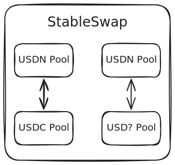

# Swap Module

The `x/swap` module is designed to facilitate the efficient exchange of tokens within the Noble blockchain ecosystem. It ensures fair exchanges and optimal rates for users. Currently, the module employs the `StableSwap` algorithm, which specializes in minimizing slippage and maintaining consistent rates for tokens with stable pricing dynamics. This makes it particularly effective for low-volatility assets.

All tokens are paired with USDN to maintain non-fragmented liquidity, enabling maximum efficiency. This structure ensures that any exchange requires at most 2 swap routes, simplifying the routing and improving liquidity utilization.



# Architecture Overview

The `x/swap` module is designed with a modular architecture that includes several key components, each playing a specific role in the swapping process. At its core is the **Controller**, which orchestrates interactions between users, liquidity pools, and the underlying state.

### Controller

The Controller is the central component responsible for managing swaps and liquidity operations. It abstracts pool-specific behaviors to provide a unified interface for managing interactions between users, liquidity pools, and the state. Its main functions include:
1. **Swaps and Routing**: The Controller calculates and executes the optimal swap given the provided route, utilizing the underlying pool algorithm. Given that all tokens are paired with USDN, the Controller will always require at most two routes, maximizing efficiency.

2. **Liquidity Management**: It handles the addition and removal of liquidity to and from pools given the relative pool type. This includes verifying input tokens, calculating pool balances/shares, and updating pool states.

4. **Fee and Rewards Handling**: It manages the application of swap fees, including protocol fees and rewards, and ensures their proper distribution based on the pool type.

5. **Security and Control**: The Controller enforces permissions and implements safeguards, such as pausing operations during unusual activity, to ensure the module's integrity.

This architecture ensures the `x/swap` module is robust, scalable, and optimized for the specific needs of Noble's ecosystem, providing a seamless experience for users and developers.


## Example: Token Swap

Suppose a user wants to exchange Token A for Token Z on the Noble blockchain using the `x/swap` module:

1. **Input and Routing**: The user specifies the desired amount of Token A to exchange for Token Z and the wanted routing: `Pool-0(usdn:a), Pool-1(usdn:z)`.

2. **First Swap (Token A -> USDN)**:
    - The Controller calculates the exchange rate for Token A to USDN using the underlying pool algorithm.
    - The specified amount of Token A is deducted from the user’s account, and the equivalent amount is credited to the liquidity pool.

3. **Second Swap (USDN -> Token Z)**:
    - The Controller calculates the exchange rate for USDN to Token Z.
    - The USDN obtained from the first swap is deducted from the liquidity pool, and the corresponding amount of Token Z is credited to the user’s account.

4. **Fees and Updates**:
    - Protocol and reward fees are applied during each swap and distributed to the pool rewards and protocol fees address.

5. **Completion**: The user receives the desired amount of Token Z in their account. The process is efficient and involves minimal slippage due to the StableSwap algorithm and the structured pairing with USDN.


## Supported Algorithms

### - StableSwap

The `StableSwap` algorithm is specifically designed to enable efficient trading between stable assets, reducing slippage and ensuring that the pool remains balanced after every transaction. At the heart of this algorithm lies the invariant \( D \), which is calculated using the formula:

```math
A \cdot n^n \cdot \prod_{i=1}^n x_i + D = A \cdot D \cdot n + \frac{D^{n+1}}{n^n \cdot \prod_{i=1}^n x_i}
```

For two-token pools \( x, y )\, the invariant simplifies to:

```math
A \cdot (x + y)^2 + D = 2 \cdot A \cdot D + \frac{D^3}{4xy}
```

Here’s what the components represent:
- \( D \): The invariant that ensures the pool remains balanced.
- \( S \): The sum of all token balances in the pool, calculated as \( S = \sum x_i \), where \( x_i \) is the balance of each token.
- \( A \): The amplification coefficient, the parameter that adjusts the pool’s sensitivity to changes in token balances.
- \( N \): The number of tokens in the pool, which in our implementation is fixed to 2.
- \( x_i \): The balance of each individual token within the pool.

---

#### How the Curve Works

The StableSwap algorithm balances liquidity by combining characteristics of both constant sum and constant product curves:

1. **Constant Sum Behavior**:
   - When the token balances in the pool are nearly equal, the formula behaves like a constant sum equation `x + y = C`.
   - This ensures very low slippage for small trades, making it ideal for stable assets where the values of the tokens are closely matched.

2. **Constant Product Behavior**:
   - When there is a significant imbalance in token balances, the curve transitions to a behavior similar to the constant product formula `x * y = k`.
   - This prevents the pool from being drained of liquidity during extreme trades and ensures that there is always a reserve of each token.

3. **Role of the Amplification Coefficient \( A \)**:
   - The amplification coefficient determines how sharply the curve shifts between constant sum and constant product behaviors.
   - A higher \( A \) value makes the pool more sensitive to changes in token balances, ensuring minimal slippage for trades involving stable assets.
   - Conversely, a lower \( A \) value reduces this sensitivity, making the pool behave more like a standard constant product model.

---

#### Key Features of StableSwap
- **Low Slippage**: The algorithm is designed to minimize price impact, particularly for stable assets where small deviations in price are undesirable.
- **Stable Pricing**: The combination of constant sum and constant product behaviors ensures predictable and stable pricing, even for larger transactions.
- **Liquidity Balance**: By dynamically adjusting the curve based on token balances, the pool maintains proportional liquidity and avoids imbalances.